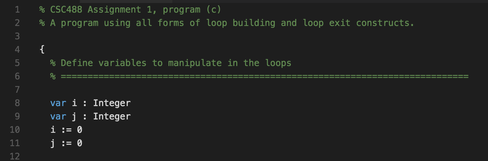

# vscode-csc488
🚧 Work-in-progress 🚧

CSC488 language extension for Visual Studio Code. Provides syntax highlighting and other features for the Winter 2017 version of the CSC488 Source Language.

## Installation
Install from the [Visual Studio Code Marketplace](https://marketplace.visualstudio.com/items?itemName=elliottsj.vscode-csc488).

## Roadmap
- [ ] Syntax highlighting
  - [x] Comments
  - [x] Control flow keywords
  - [x] Declaration keywords
  - [x] Output keywords
  - [x] Type keywords
  - [x] Expression (Boolean) keywords
  - [ ] Other syntax...
- [ ] Auto indenting
- [ ] Code navigation
  - [ ] Collapse/expand blocks
  - [ ] Go to definition
  - [ ] Find references
- [ ] Snippets
- [ ] Integrate with compiler
  - [ ] Compile code with F5
  - [ ] View compile errors in editor
- [x] Icon for VSCode marketplace

## Resources
- [VSCode: Adding Language Colorization](https://code.visualstudio.com/Docs/customization/colorizer)
- [TextMate Language Grammars](https://manual.macromates.com/en/language_grammars)
- [Sublime Text Syntax Definitions](http://sublimetext.info/docs/en/extensibility/syntaxdefs.html)
- [tmlanguage spec](https://github.com/martinring/tmlanguage)
- [VSCode Python tmLanguage](https://github.com/Microsoft/vscode/blob/master/extensions/python/syntaxes/MagicPython.tmLanguage.json)
- [VSCode JavaScript tmLanguage](https://github.com/Microsoft/vscode/blob/master/extensions/javascript/syntaxes/JavaScript.tmLanguage.json)
